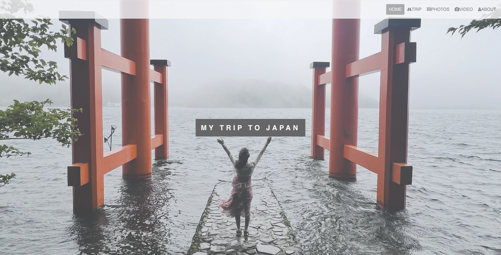

# 🎌 Modern Component-Driven Travel Journal & Portfolio

<p align="center">
   
</p>
An interactive, responsive single-page multimedia portfolio application engineered using **React 18**, **Vite**, and **ES6+**. Originally developed as a vanilla web stack, this project has been fully refactored into a modular, declarative component architecture to optimize rendering pipeline performance and client-side state predictability.

---

## 🚀 Key Engineering & Interactive Features

- **Component-Driven Architecture:** Segmented semantic layouts into scalable React JSX modules, fostering high reusability and isolated state environments.
- **Index-Tracked Carousel UI:** State-driven slideshow navigation component utilizing cyclic boundaries for continuous item loop visualization.
- **Event-Driven Lightbox Gallery:** Implements explicit React conditional rendering and dynamic properties mapping (`src`/`alt`) to serve localized travel photography via modal streams without bloating the DOM tree.
- **Context-Aware HTML5 Media Sync:** Leverages precise React component reference hooks and synthetic DOM event handlers (`onMouseEnter`/`onMouseLeave`) to dynamically trigger background multi-media loops based on client collision boundaries.
- **Optimized Bundling Pipeline:** Powered by **Vite** to ensure instantaneous Hot Module Replacement (HMR) and ultra-lean production asset tree-shaking.

---

## 🛠️ Technology Stack & Engineering Matrix

- **Core Framework:** React 18 (Functional Components, Standard/Custom Hooks)
- **Build Automation Toolchain:** Vite, Babel Compilation Layer, ESLint Configuration Profiles
- **Style Compilation:** Modular CSS Sheets & SCSS Integration
- **Asset Pipelines:** Locally served high-definition HTML5 video assets and optimized multi-resolution web imagery.

---

## 📂 Production Directory Topology

```text
├── .github/                 # Automated deployment integrations
├── public/                  # Global static resources
├── src/                     # Core application source tree
│   ├── assets/              # Raw multimedia assets
│   │   ├── food.MP4         # Embedded background MP4 loop
│   │   ├── img0.png - img9.jpg  # Multi-city landscape photography
│   │   └── self3.png / self5.jpg# Profile visual assets
│   ├── App.css              # Main layout rules & responsive breakpoints
│   ├── App.jsx              # Application root element & state distributor
│   ├── index.css            # Base stylesheet layers & CSS variables
│   └── main.jsx             # React DOM injection and strict-mode container
├── eslint.config.js         # Static code analysis configuration
├── index.html               # Multi-media shell template
├── package.json             # Module manifest & dependency registry
└── vite.config.js           # Advanced Vite compiler optimizations
```

---

## 💻 Technical Implementation Highlight

### Declared State Optimization (Vite/React Engine)

The application handles fluid animations and modular media states seamlessly by shifting away from heavy vanilla script bindings to declarative state synchronizations:

```jsx
// Simplified Blueprint of Event-Driven Multi-Media Optimization
const handleMediaPlayback = (action) => {
  if (action === "play") {
    videoRef.current.play();
  } else {
    videoRef.current.pause();
    videoRef.current.currentTime = 0;
  }
};
```

---

## 👩‍💻 About the Engineer

I am an incoming Software Engineer and a Graduate Student pursuing a Master of Computer Science (MCS) at the **University of Illinois Urbana-Champaign (UIUC)**, holding a perfect **4.0/4.0 GPA**.

My core focus balances scalable system infrastructures with human-centric Frontend UI/UX Engineering. This project demonstrates my proficiency in legacy code migrations, asset pipelining, and building sleek, interactive systems that bring human moments into digital experiences.
